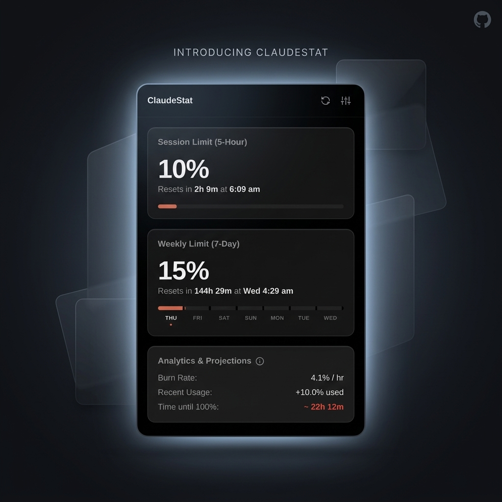

# ClaudeStat 📊

A sleek, premium, and lightning-fast Chrome Extension that lets you track your Claude.ai Pro usage directly from your browser toolbar. No more guessing when your limits reset!

  

## ✨ Features

- **Instant Loading:** Powered by an aggressive local caching engine. Your stats load in less than 10ms.
- **Dual Limits Tracking:** Explicitly tracks both your **5-Hour Session Limit** and your **7-Day Weekly Limit**.
- **Real-time Countdowns:** Live timers ticking down exactly to the second your usage limits reset.
- **Background Sync:** Silently fetches fresh data in the background and seamlessly updates the UI without jarring reloads or glitches.
- **Premium UI/UX:** Designed with a stunning, native-feeling dark mode, buttery smooth entrance animations, and Apple-Watch style SVG progress rings.
- **Offline Resilience:** Gracefully handles offline scenarios, displaying your last-known cached data with a helpful "Offline" badge.
- **Zero Configuration:** Automatically piggybacks off your existing Claude.ai web session. No API keys needed!

## 🚀 Installation

Because this extension interfaces directly with Claude's internal web API, it is intended to be sideloaded rather than installed from the Chrome Web Store.

1. Download or clone this repository.
2. Open Google Chrome and navigate to `chrome://extensions`.
3. Toggle **"Developer mode"** on (top right corner).
4. Click **"Load unpacked"** (top left corner) and select this project folder.
5. Pin the shiny new Claude icon to your toolbar!

> **Note:** You must be logged into [claude.ai](https://claude.ai) in your browser for the extension to fetch your stats.

## 🛠 Architecture

Built with a modern, modular, and maintainable architecture following Manifest V3 guidelines:

- **Service Worker (`service-worker/`):** Acts as the central data controller. It securely fetches data from `claude.ai` and manages cross-origin communication.
- **Repository Pattern (`lib/repository/`):** Abstracts away the complexity of checking the cache, firing network requests, and auto-discovering organization IDs.
- **Data Normalizer (`lib/api/normalizer.js`):** Isolates the UI from internal API schema changes. It robustly maps Claude's raw undocumented JSON into our own strict internal models.
- **Smart Caching (`lib/storage/`):** Implements a 5-minute TTL cache with built-in schema migration validation to prevent `NaN%` errors if the data structure changes.
- **Vanilla JS & CSS:** Zero external dependencies. Keeps the extension extremely lightweight, secure, and fast.

## ⚙️ Settings

Click the gear icon inside the extension to open the Settings panel:
- **Theme Override:** Force Dark, Light, or follow System preferences.
- **Reduce Motion:** Disable UI animations for a static, distraction-free experience.
- **Clear Cache:** Manually wipe the local cache to force a hard refresh.
- **Organization ID Override:** (Advanced) If you belong to multiple orgs, you can manually specify which one to track.

## 🔒 Security & Privacy

This extension is designed with a **Zero Configuration** and **Zero Credential** philosophy. 

**Is it safe to push this code to GitHub?**
Yes! You are 100% safe to push this codebase publicly. Your cookies, auth info, and personal data are **NOT** hardcoded or stored anywhere in the codebase.

**How does it authenticate?**
1. The extension never explicitly asks for, touches, or saves your `sessionKey` or passwords.
2. It uses Chrome's native `host_permissions` for `https://claude.ai/*`. This tells the browser: *"When this extension makes a background request to Claude.ai, please attach the user's existing Claude cookies automatically."*
3. All requests happen securely within the memory of your local browser using the "Piggyback Method." 
4. If you log out of Claude.ai in a regular Chrome tab, the extension instantly loses access. 

Because the extension relies entirely on the browser dynamically attaching your active session at runtime, there are zero hardcoded secrets. If anyone downloads your code, it will simply look at *their* browser's cookies and fetch *their* usage data. Your account is completely isolated.

## ⚠️ Disclaimer

This extension relies on an undocumented, internal Claude.ai API to fetch usage data. Because it is not an official public API, Anthropic may change the data structure or endpoint at any time. If that happens, the extension may temporarily stop working until the `lib/api/normalizer.js` file is updated to match their new schema. 

*This project is not affiliated with, endorsed by, or sponsored by Anthropic.*

## 📄 License

feel free to fork, modify, and distribute!
